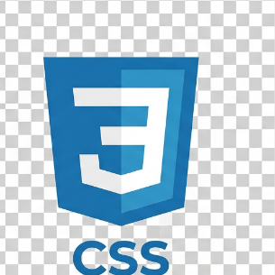
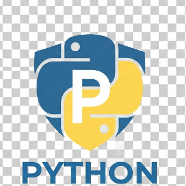

# Hi there, I'm Hailemariam Tesfaye 👋

I'm a **Frontend Web Developer** and **Backend Developer** (supported by AI), passionate about building web applications and mobile apps.

---

### 🌐 My Website
Check out my portfolio and live projects at **[hailedev5-dotcom.github.io](https://hailedev5-dotcom.github.io)**.

---

### 🛠️ Languages & Tools

  
  &nbsp;&nbsp;
  
  &nbsp;&nbsp;
  
  &nbsp;&nbsp;
  

- **Frontend:** HTML5, CSS3, JavaScript
- **Backend & Scripting:** Python
- **Documentation & Formatting:** Markdown
- **Focus:** Web Development & App Creation

---
<table>
                      <thead>
                        <tr>
                          <th style="color:orange;background-color:#6e1718;font-size:1.2rem;font-family:Roboto;border-radius:5px"> coding languages</th>  
                          <th style="color:orange;background-color:#7e1f89;font-size:1.2rem;font-family:Roboto;border-radius:5px">experience(percent)</th>
                        </tr>
                      </thead>
                      <tr>
                        <th style="color:orange;background-color:#6e1718;font-size:1rem;font-family:Roboto;border-radius:5px">html & css</th>
                        <th style="color:orange;background-color:#7e1f89;font-size:1rem;font-family:Roboto;border-radius:5px">100%</th>
                      </tr>
                          <tr>
                            <th style="color:orange;background-color:#6e1718;font-size:1rem;font-family:Roboto;border-radius:5px">JAVASCRIPT (learning)</th>
                        <th style="color:orange;background-color:#7e1f89;font-size:1rem;font-family:Roboto;border-radius:5px">75%</th>
                      </tr>
                         <tr>
                        <th style="color:orange;background-color:#6e1718;font-size:1rem;border-radius:5px">phyton</th>
                        <th style="color:orange;background-color:#7e1f89;font-size:1rem;border-radius:5px">25-35%</th>
                      </tr>
                           <tr>
                        <th style="color:orange;background-color:#6e1718;font-size:1rem;border-radius:5px">Markdown</th>
                        <th style="color:orange;background-color:#7e1f89;font-size:1rem;border-radius:5px">100%</th>
                           </tr>
                    </table>

### ⚡ Quick Stats

---

📫 **Reach out:** Feel free to explore my repositories or check out my website!
